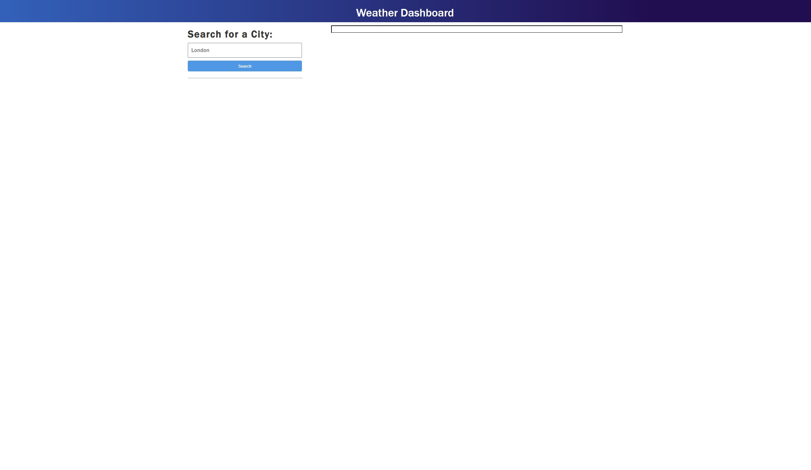

# weather-dashboard

The weather dashboard has been created to allow users to search a city to see the weather forcast for the current time and future 5 days. The Temp, humidity and wind speed will be displayed by each day along with weather icons. 

(https://smntsng.github.io/work-day-scheduler/)

## Instructions

1. Add an event to the time block and click save
  
 

 
2. when you come back to this page, your event will still remain on the page.

## License

